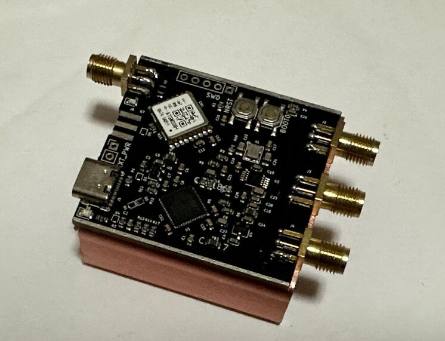

# Mini SI5351 GPSDO



Features
- VC-TCXO at 10MHz
- SI5351 PLL chip, arbitrary frequency output
- All 3 outputs broken out
- STM32G431 microprocessor
- JLCPCB-assembled
- Designed to fit a 45cm by 45cm by 18.5cm aluminium enclosure.
- Front and back PCB panels coming soon.

## Manufacturing

Obtain the three files in `hardware/jlcpcb/production_files`

- Upload the gerber to the order page, choose SMT assembly
- Upload the BOM and CPL file in the SMT assembly page.

## Firmware

- If the flash is empty, press the BOOT0 button, then the NRST button and release both, if the firmware is already flashed, you can skip this step.
- Run `dfu-util -a 0 -s 0x08000000:leave -D si5351_gpsdo.bin`
  
### Building

Within the `firmware` folder, run
```
cmake -DCMAKE_TOOLCHAIN_FILE=cubeide-gcc.cmake  -S ./ -B Release -G"Unix Makefiles" -DCMAKE_BUILD_TYPE=Release
make -C Release VERBOSE=1 -j
```